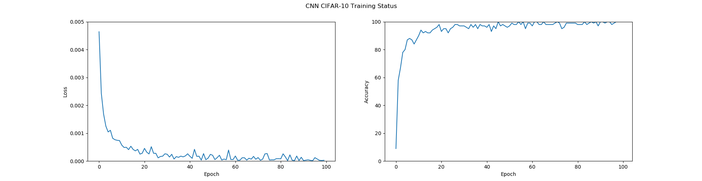

# 使用深度学习对 CIFAR-10 进行分类

### 实验目的

使用深度学习方法对 CIFAR-10 数据集进行分析、测试。

### 实验说明

本次实验深度学习的方法使用了卷积神经网络构建模型从`CIFAR-10`数据集进行训练和测试。
`CIFAR-10`数据集中共包含 50000 张训练图片和 10000 张测试图片，共 10 个类别，分别是：_airplane_, _automobile_, _bird_, _cat_, _dog_, _frog_, _horse_, _ship_, _truck_。

### 实验步骤

1. 加载训练集
2. 使用`transforms`对数据进行预处理
3. 定义神经网络模型
4. 使用定义的网络模型进行训练
5. 对训练好的模型进行测试，测试模型的整体准确性和针对不同类型的准确性。

### 模型构建

#### 卷积神经网络

构建卷积神经网络模型，使用多层次的$卷积层+池化层$。
这里模仿了 VGG 的网络模型，使用了多个$3\times3$的卷积核。经检验，这样的模型的识别效果表现还不错。
| Input（32×32×3）color image|
|:----:|
|Conv1 3×3, 64|
|Conv2 3×3, 64|
|Maxpool 2×2, strides = 2|
|Batch Normalization|
|Relu|
|-|
|Conv3 3×3, 128|
|Conv4 3×3, 128|
|Maxpool 2×2, strides = 2|
|Batch Normalization|
|Relu|
|-|
|Conv5 3×3, 128|
|Conv6 3×3, 128|
|Conv7 1×1, 128|
|Maxpool 2×2, strides = 2|
|Batch Normalization|
|Relu|
|-|
|Conv8 3×3, 256|
|Conv9 3×3, 256|
|Conv10 1×1, 256|
|Maxpool 2×2, strides = 2|
|Batch Normalization|
|Relu|
|-|
|Conv11 3×3, 512|
|Conv12 3×3, 512|
|Conv13 1×1, 512|
|Maxpool 2×2, strides = 2|
|Batch Normalization|
|Relu|
|-|
|FC14 (8192, 1024)|
|Dropout|
|Relu|
|FC15 (1024, 1024)|
|Dropout|
|Relu|
|FC16 (1024, 10)|

```python
class Net(nn.Module):

    def __init__(self, trainloader, testloader):
        super(Net, self).__init__()
        self.trainloader = trainloader
        self.testloader = testloader

        self.conv1 = nn.Conv2d(3, 64, 3, padding=1)
        self.conv2 = nn.Conv2d(64, 64, 3, padding=1)
        self.pool1 = nn.MaxPool2d(2, 2)
        self.bn1 = nn.BatchNorm2d(64)
        self.relu1 = nn.ReLU()

        self.conv3 = nn.Conv2d(64, 128, 3, padding=1)
        self.conv4 = nn.Conv2d(128, 128, 3, padding=1)
        self.pool2 = nn.MaxPool2d(2, 2, padding=1)
        self.bn2 = nn.BatchNorm2d(128)
        self.relu2 = nn.ReLU()

        self.conv5 = nn.Conv2d(128, 128, 3, padding=1)
        self.conv6 = nn.Conv2d(128, 128, 3, padding=1)
        self.conv7 = nn.Conv2d(128, 128, 1, padding=1)
        self.pool3 = nn.MaxPool2d(2, 2, padding=1)
        self.bn3 = nn.BatchNorm2d(128)
        self.relu3 = nn.ReLU()

        self.conv8 = nn.Conv2d(128, 256, 3, padding=1)
        self.conv9 = nn.Conv2d(256, 256, 3, padding=1)
        self.conv10 = nn.Conv2d(256, 256, 1, padding=1)
        self.pool4 = nn.MaxPool2d(2, 2, padding=1)
        self.bn4 = nn.BatchNorm2d(256)
        self.relu4 = nn.ReLU()

        self.conv11 = nn.Conv2d(256, 512, 3, padding=1)
        self.conv12 = nn.Conv2d(512, 512, 3, padding=1)
        self.conv13 = nn.Conv2d(512, 512, 1, padding=1)
        self.pool5 = nn.MaxPool2d(2, 2, padding=1)
        self.bn5 = nn.BatchNorm2d(512)
        self.relu5 = nn.ReLU()

        self.fc14 = nn.Linear(512*4*4, 1024)
        self.drop1 = nn.Dropout2d()
        self.fc15 = nn.Linear(1024, 1024)
        self.drop2 = nn.Dropout2d()
        self.fc16 = nn.Linear(1024, 10)

    def forward(self, x):
        x = self.conv1(x)
        x = self.conv2(x)
        x = self.pool1(x)
        x = self.bn1(x)
        x = self.relu1(x)

        x = self.conv3(x)
        x = self.conv4(x)
        x = self.pool2(x)
        x = self.bn2(x)
        x = self.relu2(x)

        x = self.conv5(x)
        x = self.conv6(x)
        x = self.conv7(x)
        x = self.pool3(x)
        x = self.bn3(x)
        x = self.relu3(x)

        x = self.conv8(x)
        x = self.conv9(x)
        x = self.conv10(x)
        x = self.pool4(x)
        x = self.bn4(x)
        x = self.relu4(x)

        x = self.conv11(x)
        x = self.conv12(x)
        x = self.conv13(x)
        x = self.pool5(x)
        x = self.bn5(x)
        x = self.relu5(x)
        x = x.view(-1, 512*4*4)
        x = F.relu(self.fc14(x))
        x = self.drop1(x)
        x = F.relu(self.fc15(x))
        x = self.drop2(x)
        x = self.fc16(x)

        return x
```

### 运行结果与分析

#### 卷积神经网络

使用卷积神经网络作为模型进行训练，经过 100 轮过后，得到训练集中准确率达到 100%。
可以看到在下图中，使用 CNN 训练过程中函数梯度下降比较快，在 5-10 个 Epoch 内就可以收敛到一个比较小的值，在训练集的准确率已经超过 90%。


使用卷积神经网络根据 CIFAR-10 数据进行分类，经过 100 轮的训练，在 10000 个图片的测试集上，最终准确率为：**84.120%**

```
Accuracy of the network on the 10000 test images: 84.120 %
Accuracy of plane : 89 %
Accuracy of   car : 88 %
Accuracy of  bird : 78 %
Accuracy of   cat : 72 %
Accuracy of  deer : 87 %
Accuracy of   dog : 74 %
Accuracy of  frog : 89 %
Accuracy of horse : 85 %
Accuracy of  ship : 89 %
Accuracy of truck : 88 %
```

### 结论

从下表可以看出卷积神经网络可以得到一个比较好的结果。
| Type | CNN |
|:-: | :-: |
|plane| 89% |
| car | 88% |
| bird| 78% |
| cat | 72% |
| deer| 87% |
| dog | 74% |
| frog| 89% |
|horse| 85% |
| ship| 89% |
|truck| 88% |
|**total**| **84.12%**|